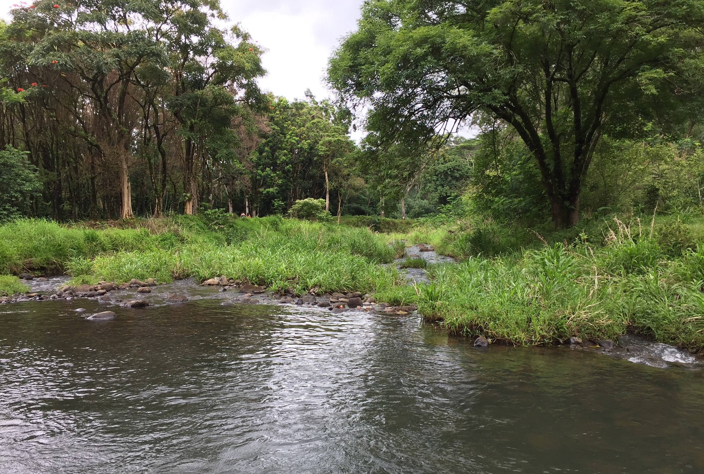

# Getting Started

1. Clone the repository
1. `cd` to the project directory
1. Run the command `pip install -r requirements.txt`
1. Run the command `python index.py` to start your application 

# Brought to you by Lava Dodgers LLC
* ### Zach Nicholson
* #### Elijah Lavoie
* #### Kaleb Moran
* #### John Bain
* ###### Chris Cotton